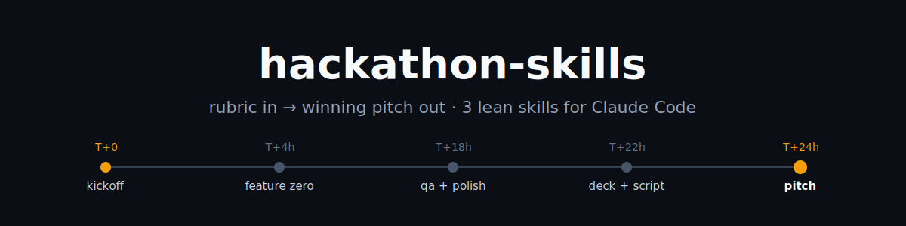

<p align="center">
  
</p>

<p align="center">
  <strong>Turn a problem statement + judging rubric into a scored solution angle, a polished demo, a deck, and a timed pitch script split across your team, before the deadline eats you alive.</strong>
</p>

<p align="center">
  
  
  
  
</p>

It's midnight. The demo half-works, nobody has started the slides, nobody has decided who says what on stage, and judging is in nine hours. Every hackathon team hits this moment. This repo exists so yours hits it with a plan.

## Install (10 seconds)

```
/plugin marketplace add zghanw/hackathon-skills
/plugin install hackathon-skills@hackathon-skills
```

Using Cursor, Codex, OpenCode, or another agent? The skills use the open `SKILL.md` standard: `npx skills add zghanw/hackathon-skills`.

## What you get

Three skills covering the part of a hackathon no other tool does well: the **judging layer**. Everyone builds; the teams that place are the ones that build *what the rubric pays for* and then pitch it inside the time limit.

| Skill | The moment you need it | Output |
|---|---|---|
| **`/hackathon-kickoff`** | Problem statement + marking scheme just dropped | Candidate angles gut-scored against the weighted rubric, a one-sentence urgency hook, a phase plan back-solved from the deadline, pre-agreed scope cuts → [`HACKATHON.md`](templates/HACKATHON.md) |
| **`/hackathon-flow`** | 3am, can't remember what's next | Reads what's on disk, tells you the next move and exactly which skill runs it |
| **`/pitch-timebox`** | "You have 5 minutes and there are four of you" | Word-budgeted script sliced by rubric weight, per-speaker blocks with handoff lines, demo-fallback plan, Q&A prep, rehearsal checklist → [`PITCH.md`](templates/PITCH.md) |

**See the output before you install:** [examples/ecoeats-24h/](examples/ecoeats-24h/) is a complete worked example (fictional 24h campus hackathon, 4 teammates, 5-minute pitch) showing exactly what both artifacts look like filled in.

Also in the box: [the 15 questions judges actually ask](references/judge-questions.md), grouped by rubric criterion, each with what a strong answer contains. `/pitch-timebox` builds your Q&A sheet from it.

## See it work

```
You:    /hackathon-kickoff
Claude: Paste the problem statement and the judging rubric.
You:    [paste] · 24 hours, 5-min pitch, team of 4.
Claude: Criteria: Impact 30% · Technical 25% · Innovation 25% · Presentation 20%
        Three candidate angles, scored against those weights:
          A. surplus-food alerts    4.5   ← only angle with a physical demo moment
          B. meal-plan optimizer    3.25
          C. composting tracker     3.05
        Go with A? The urgency hook writes itself from the campus audit numbers.
You:    A.
Claude: HACKATHON.md written: angle, hook, Feature Zero at T+4h, phase plan
        with a named skill and owner per checkpoint, scope cuts pre-agreed.

        [ 22 hours of building later ]

You:    /pitch-timebox
Claude: 5 minutes, 4 speakers → ~640 usable words. Demo gets 2:15 (Impact and
        Technical are 55% of your score; judges must SEE it work).
        PITCH.md written: timed blocks, handoff lines, demo fallback,
        Q&A sheet targeting your weakest criterion. Rehearse twice, stopwatch.
```

## The full pipeline

The 3 skills handle the judging layer. For every other phase there's already a great skill someone else maintains. [SCENARIOS.md](SCENARIOS.md) is the full situation → skill decision table, and `/hackathon-flow` routes you through it:

```
problem statement + rubric
        │
        ▼
  /hackathon-kickoff  ──────▶  HACKATHON.md (angle, urgency hook, phase plan)
        │
        ▼
  superpowers: brainstorming  ──▶  concrete spec
        │
        ▼
  superpowers: writing-plans → executing-plans  ──▶  Feature Zero, then features
        │        (or build straight off the plan, skip the TDD loop, if faster)
        ▼
  ui-ux-pro-max (UI polish)  ──▶  gstack /design-review, /qa
        │
        ▼
  beautiful-hackathon-slides  or  pptx skill  ──▶  deck (+ narration script)
        │
        ▼
  /pitch-timebox  ──────▶  PITCH.md (timing, speakers, Q&A, rehearsal)
        │
        ▼
  gstack /qa-only dry run  ──▶  go pitch
```

## Built lean on purpose

A lot of skill collections are 40, 150, sometimes 2,000+ skills in one install. Every installed skill's name and description sits in Claude's context on every message: tokens spent, every turn, on skills you'll never touch during a weekend hackathon. You don't need a regulatory-compliance skill to ship a demo by Sunday.

This repo ships **3 skills** and a decision table pointing at the rest. Install companions when you reach the phase that needs them, not before:

```
# Brainstorming through actual implementation (spec → plan → TDD build)
/plugin install superpowers@claude-plugins-official

# UI polish: styles, color palettes, font pairings, component patterns
/plugin marketplace add nextlevelbuilder/ui-ux-pro-max-skill
/plugin install ui-ux-pro-max@ui-ux-pro-max-skill
```

```
# QA, design review, shipping. NOT a Claude Code plugin, installs straight into ~/.claude/skills
git clone --single-branch --depth 1 https://github.com/garrytan/gstack.git ~/.claude/skills/gstack && cd ~/.claude/skills/gstack && ./setup
```

```
# Zero-dependency HTML deck: narration script + live-demo slots. Also not on a plugin marketplace yet
git clone https://github.com/Esther2524/beautiful-hackathon-slides.git ~/.claude/skills/beautiful-hackathon-slides
```

Verified directly against each project's current source as of July 2026, so these won't match every guide you find online:

- `superpowers` is on Anthropic's official marketplace, which most Claude Code installs already have registered. It's more than brainstorming: it's a full spec → plan → build pipeline with mandatory TDD and per-task review. Use `brainstorming` and `writing-plans` either way; for the build itself, weigh that rigor against just building off the plan, since full TDD ceremony can cost hours a throwaway demo doesn't have.
- `gstack` **is not currently a Claude Code plugin**: its repo has no `.claude-plugin` manifest, despite third-party mirrors claiming a `/plugin` install. The clone command above is what its own README documents. Re-run `./setup` after every `git pull`.
- `ui-ux-pro-max`'s marketplace install has a known symlink bug on some setups; if it fails, fall back to `npm install -g ui-ux-pro-max-cli && uipro init --ai claude`.
- `beautiful-hackathon-slides` is the same story as gstack: its own README says "Plugin Marketplace publishing is coming soon," git clone is the documented method today. Triggers automatically when you ask for a hackathon pitch deck, or invoke `/beautiful-hackathon-slides` directly.
- If judges specifically require an uploaded `.pptx` instead of an HTML deck: the `pptx` skill from [anthropics/skills](https://github.com/anthropics/skills) (often already bundled in your environment).

If anything here drifts by the time you read it, re-check the source repo's own README, and open a PR here: that's exactly the kind of contribution this repo wants.

<details>
<summary>Why not declare these as plugin dependencies and auto-install them?</summary>

Claude Code supports a `dependencies` field that auto-installs other plugins. Declaring superpowers + gstack + ui-ux-pro-max there would force a 13-skill methodology, a QA/ship suite, and a full style library onto every team regardless of need, which is the exact bloat this section argues against. Each skill's `SKILL.md` names its companions in a Prerequisites section instead, so you know what to add and when, and nothing installs itself.
</details>

## Which hackathon tool should I use?

Honest comparison. These overlap less than they look:

| | **hackathon-skills** (this) | [claude-plugin-hackathoner](https://github.com/fshot/claude-plugin-hackathoner) | [devcon-hack-coach](https://github.com/mertpaker/devcon-hack-coach) |
|---|---|---|---|
| Shape | 3 composable skills + a routing guide | One all-in-one system: GitHub-issue driven, generates project-specific skills, `/hack` build loop | Single coaching skill, 4 gated phases |
| Rubric-weighted angle scoring | ✓ core feature | constrained brainstorm, not weight-scored | track-aware |
| Multi-speaker timed pitch script | ✓ core feature | demo-video roles | 3-sentence pitch template |
| Judge Q&A prep | ✓ per-criterion, from a question bank | none | 5 rehearsed answers |
| Code-building | routes to superpowers (your choice of rigor) | built-in `/hack` issue loop | refuses code before a spec |
| Context footprint | 3 skills | large | 1 skill |
| Pick it when… | you want lean + best-tool-per-phase | you want one opinionated pipeline for the whole team | you're solo with 24h and scope discipline is your weakness |

## Who this is for

Students and small teams doing hackathons: no ops team, no dedicated designer, the same four people writing the code, designing the deck, and delivering the pitch before a hard deadline. If that's your Saturday, this is for you.

## Contributing

The best PRs come from the venue floor: a scenario row this table missed, a judge question you actually got asked, a template field you added at 4am. See [CONTRIBUTING.md](CONTRIBUTING.md); CI validates manifests and skill frontmatter automatically.

If this saved your team an hour of scrambling, a ⭐ helps the next team find it before *their* deadline.

## License

MIT. See [LICENSE](LICENSE).
